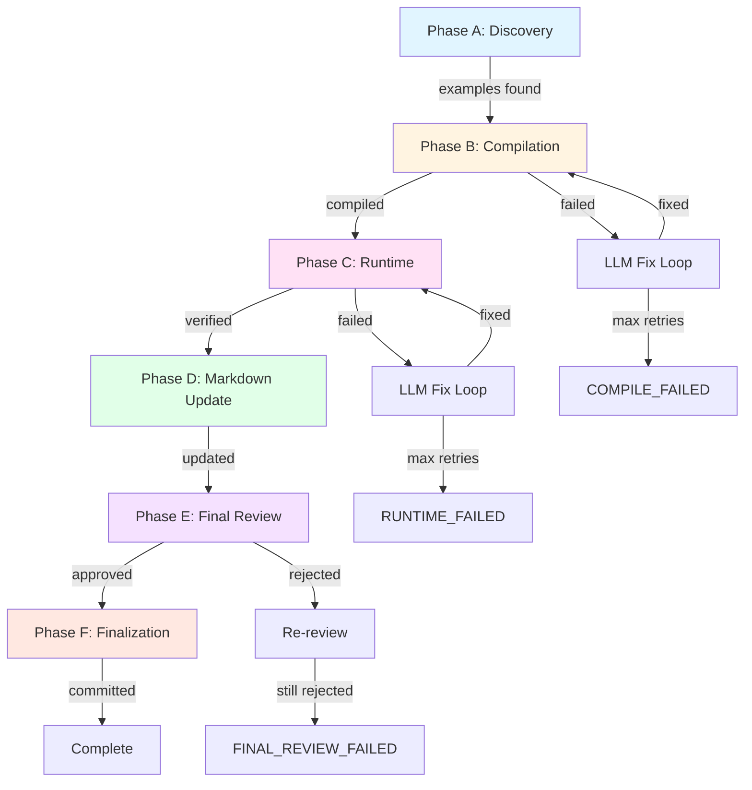
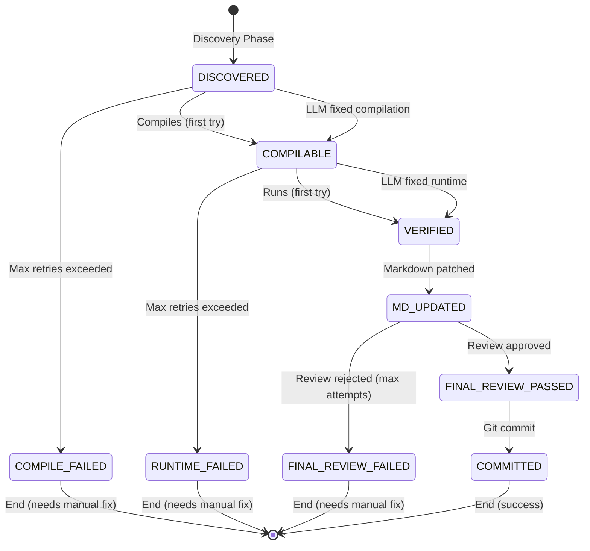

# Example Reviewer System Architecture

**Last Updated**: 2026-01-16 22:00 PKT
**Version**: 2.0
**Status**: Current Implementation

---

## Table of Contents

1. [System Overview](#system-overview)
2. [Multi-Phase Pipeline Architecture](#multi-phase-pipeline-architecture)
3. [Service Layer](#service-layer)
4. [Database Schema](#database-schema)
5. [Configuration System](#configuration-system)
6. [Quality Gates](#quality-gates)
7. [Extensibility Points](#extensibility-points)
8. [Legacy Documentation](#legacy-documentation)

---

## System Overview

The Example Reviewer is an automated pipeline for validating, fixing, and updating code examples in Aspose documentation. It uses a multi-phase approach to ensure code examples compile, execute correctly, and remain accurate over time.

### High-Level Architecture

```
┌─────────────────────────────────────────────────────────────────┐
│                      Example Reviewer Pipeline                   │
├─────────────────────────────────────────────────────────────────┤
│                                                                   │
│  ┌───────────┐   ┌────────────┐   ┌────────────┐   ┌─────────┐ │
│  │ Phase A   │──▶│ Phase B    │──▶│ Phase C    │──▶│ Phase D │ │
│  │ Discovery │   │ Compilation│   │  Runtime   │   │Markdown │ │
│  └───────────┘   └────────────┘   └────────────┘   └─────────┘ │
│        │                │                │                │       │
│        ▼                ▼                ▼                ▼       │
│  ┌────────────────────────────────────────────────────────────┐ │
│  │                    SQLite Database                          │ │
│  │  (examples, attempts, edits, telemetry, reviews, commits)  │ │
│  └────────────────────────────────────────────────────────────┘ │
│        │                                                          │
│        ▼                                                          │
│  ┌───────────┐   ┌─────────────┐                                │
│  │ Phase E   │──▶│   Phase F   │                                │
│  │   Final   │   │Finalization │                                │
│  │  Review   │   │   & Commit  │                                │
│  └───────────┘   └─────────────┘                                │
│                                                                   │
└─────────────────────────────────────────────────────────────────┘
```

### Technology Stack

- **Language**: Python 3.8+
- **Database**: SQLite with WAL mode
- **Compilation**: .NET 8.0 SDK
- **LLM**: OpenAI API / Ollama (local)
- **Vector DB**: ChromaDB (for similarity search)
- **Configuration**: Pydantic + JSON
- **Telemetry**: HTTP API + local file export

### Design Principles

1. **Deterministic**: Same input produces same output
2. **Auditable**: All decisions logged to database
3. **Recoverable**: Pipeline can resume after failures
4. **Extensible**: Easy to add new families, validators, patterns
5. **Traceable**: Full lineage from discovery to commit

### Core Components

- **PipelineOrchestrator**: Main controller ([orchestrator.py:31-1349](../../src/pipeline/orchestrator.py#L31))
- **ConfigurationManager**: Hierarchical config loader ([config.py:236-445](../../src/core/config.py#L236))
- **Database**: SQLite with comprehensive schema ([database.py:24-1511](../../src/core/database.py#L24))
- **Service Layer**: Modular services for each phase
- **Quality Gates**: Multi-layered validation system

---

## Multi-Phase Pipeline Architecture

The pipeline consists of 6 sequential phases (A-F), each with specific responsibilities and quality gates.

### Pipeline Flow Diagram



### Phase A: Discovery and Extraction

**Purpose**: Scan markdown files and extract C# code examples
**Input**: Content roots from family config
**Output**: `example_records` with status `DISCOVERED`
**Service**: [DiscoveryService](../../src/services/discovery_service.py)

#### Flow

```
1. Scan content_roots for markdown files
2. Parse markdown with Python-Markdown
3. Extract code blocks and gist shortcodes
4. Classify snippets (inline vs gist)
5. For gists: Fetch from GitHub API (with caching)
6. Extract context: section heading, description, topic
7. Store in database with DISCOVERED status
8. Record telemetry metrics
```

#### Key Features

- **Inline Code Blocks**: ` ```csharp ... ``` ` directly in markdown
- **GitHub Gists**: `` shortcodes
- **Context Extraction**: Section headings, descriptions for LLM context
- **Content Deduplication**: Hash-based duplicate detection
- **Caching**: ETag-based GitHub API caching

#### Source Reference

- Implementation: [discovery_service.py](../../src/services/discovery_service.py)
- Orchestrator call: [orchestrator.py:426-449](../../src/pipeline/orchestrator.py#L426)

---

### Phase B: Compilation Verification Loop

**Purpose**: Compile C# code against Aspose NuGet packages
**Input**: Examples with status `DISCOVERED`
**Output**: `COMPILABLE` or `COMPILE_FAILED`
**Service**: [CompilationService](../../src/services/compilation_service.py)

#### Flow

```
1. Get DISCOVERED examples from database
2. For each example:
   a. Create isolated .NET workspace
   b. Generate .csproj with NuGet references
   c. Compile with `dotnet build`
   d. If success → COMPILABLE
   e. If failure:
      - Categorize errors (namespace, type, member, syntax)
      - Generate fix hints based on error categories
      - Call LLM with API context + similar examples
      - Retry compilation with fixed code
      - Repeat up to max_retries (default: 5)
   f. Record attempt in compile_attempts table
3. Store successful examples in vector DB
```

#### LLM Context Enrichment (LCE-01, LCE-02, LCE-03)

The compilation phase enriches LLM fix requests with:

1. **API Reference Context** (LCE-01): Cached API docs from `api_reference.cache_path`
2. **Similar Examples** (LCE-02): Vector search in ChromaDB for verified examples
3. **Full Payload** (LCE-03):
   - Original code
   - Compiler errors
   - Scaffolding hints
   - API context (up to 4000 chars)
   - Similar verified examples (top 3)
   - Section heading, description, topic

#### Quality Gates

- **Namespace Validation**: Check for hallucinated namespaces
- **Pattern Detection**: Detect known anti-patterns (e.g., `DeflateCompressionSettings(param)`)
- **Infinite Loop Detection**: Stop if same error repeats 3 times

#### Source Reference

- Implementation: [compilation_service.py](../../src/services/compilation_service.py)
- Orchestrator call: [orchestrator.py:451-635](../../src/pipeline/orchestrator.py#L451)
- LLM fix logic: [orchestrator.py:549-621](../../src/pipeline/orchestrator.py#L549)

---

### Phase C: Runtime Verification Loop

**Purpose**: Execute compiled code with test data
**Input**: Examples with status `COMPILABLE`
**Output**: `VERIFIED` or `RUNTIME_FAILED`
**Service**: [RuntimeService](../../src/services/runtime_service.py)

#### Flow

```
1. Get COMPILABLE examples from database
2. Pre-flight: Auto-backfill test data if missing (optional)
3. For each example:
   a. Create isolated runtime workspace
   b. Copy test data to workspace
   c. Execute with `dotnet run` (subprocess)
   d. Capture: stdout, stderr, exit_code, exception details
   e. If success → VERIFIED
   f. If failure:
      - Detect build failure vs runtime failure
      - If build failure: Use compilation prompts
      - If runtime failure: Use runtime prompts
      - Load API context + similar examples (LCE-04)
      - Call LLM with error context
      - Re-execute with fixed code
      - Prevent cascading degradation (don't use fix if it makes things worse)
      - Repeat up to max_retries (default: 5)
   g. Record attempt in runtime_attempts table
4. Store verified examples in vector DB
```

#### Build Failure Detection

Distinguishes between:
- **Build Failures**: Compilation errors during runtime (use compilation prompts)
- **Runtime Failures**: Actual execution errors (use runtime prompts)

Detection logic: [orchestrator.py:170-194](../../src/pipeline/orchestrator.py#L170)

#### Cascading Degradation Prevention

If LLM fix introduces build errors when original code compiled, the fix is rejected:

```python
if new_is_build_error and not prev_was_build_error:
    logger.warning("Fix introduced build errors, keeping previous code")
    continue  # Don't cascade the degradation
```

Source: [orchestrator.py:915-922](../../src/pipeline/orchestrator.py#L915)

#### Test Data Auto-Backfill

If test data is missing, the pipeline can auto-download from GitHub:

```python
if global_config.backfill.auto_enabled:
    result = backfill_service.backfill_test_data(family=family)
```

Source: [orchestrator.py:655-685](../../src/pipeline/orchestrator.py#L655)

#### Source Reference

- Implementation: [runtime_service.py](../../src/services/runtime_service.py)
- Orchestrator call: [orchestrator.py:637-951](../../src/pipeline/orchestrator.py#L637)
- Backfill service: [backfill_service.py](../../src/services/backfill_service.py)

---

### Phase D: Markdown Update

**Purpose**: Patch verified code back into markdown files
**Input**: Examples with status `VERIFIED`
**Output**: `MD_UPDATED` and modified markdown files
**Service**: [MarkdownUpdateService](../../src/services/markdown_service.py)

#### Flow

```
1. Get VERIFIED examples from database
2. Group by file_path
3. For each file:
   a. Read original markdown
   b. For each example in file:
      - Locate original code block by line numbers
      - Generate unified diff
      - Replace with verified_code
      - Preserve fence markers and language
   c. Handle gists:
      - If unchanged: keep shortcode
      - If changed: replace with inline fence (based on gist.upload_mode)
   d. Write updated markdown
   e. Record edit in markdown_edits table
4. Update example status to MD_UPDATED
```

#### Gist Handling Modes

- **`inline-only`** (default): Never upload gists, always inline changes
- **`upload-on-change`**: Upload changed gists, inline unchanged
- **`upload-always`**: Always upload to new gists

Configuration: [config/global.json:36](../../config/global.json#L36)

#### Source Reference

- Implementation: [markdown_service.py](../../src/services/markdown_service.py)
- Orchestrator call: [orchestrator.py:953-959](../../src/pipeline/orchestrator.py#L953)

---

### Phase E: Final LLM Review

**Purpose**: Human-like review of updated markdown for quality/accuracy
**Input**: Examples with status `MD_UPDATED`
**Output**: `FINAL_REVIEW_PASSED` or `FINAL_REVIEW_FAILED`
**Service**: [LLMService](../../src/services/llm_service.py)

#### Flow

```
1. Get MD_UPDATED examples from database
2. Group by file_path
3. For each file:
   a. Read updated markdown
   b. Build snippet list with example_ids
   c. Run consensus review (2 passes + tiebreaker if needed)
   d. Each review checks:
      - Syntax errors
      - Logic errors
      - API misuse
      - Incomplete examples
      - Documentation inconsistencies
   e. Parse structured issues (JSON)
   f. Store review result in review_results table
   g. Store issues in review_issues table
   h. If approved: FINAL_REVIEW_PASSED
   i. If rejected: Re-review up to max_review_attempts
   j. If still rejected: FINAL_REVIEW_FAILED
```

#### Consensus Review

To improve reliability, reviews use consensus voting:

```python
def _consensus_review(content, snippets, num_passes=2):
    reviews = []
    for pass_num in range(num_passes):
        reviews.append(llm_service.review_markdown_structured(content, snippets))

    if all(r['approved'] for r in reviews):
        return {'approved': True, 'confidence': 'high'}
    elif not any(r['approved'] for r in reviews):
        return {'approved': False, 'confidence': 'high'}
    else:
        # Split decision - run tiebreaker
        tiebreaker = llm_service.review_markdown_structured(content, snippets)
        return {'approved': tiebreaker['approved'], 'confidence': 'medium'}
```

Source: [orchestrator.py:961-1034](../../src/pipeline/orchestrator.py#L961)

#### Issue Tracking

All issues are structured and persisted:

```python
ReviewIssue(
    review_id=review_id,
    example_id=example_id,
    issue_type=IssueType.SYNTAX_ERROR,
    severity=IssueSeverity.CRITICAL,
    description="Missing semicolon at line 42",
    suggestion="Add semicolon after statement"
)
```

Source: [database.py:215-231](../../src/core/database.py#L215)

#### Source Reference

- Implementation: [llm_service.py](../../src/services/llm_service.py)
- Orchestrator call: [orchestrator.py:1036-1209](../../src/pipeline/orchestrator.py#L1036)
- Review models: [models.py](../../src/core/models.py)

---

### Phase F: Persist, Telemetry, Commit

**Purpose**: Export telemetry, commit changes to git
**Input**: Examples with status `FINAL_REVIEW_PASSED`
**Output**: Git commit, telemetry exports
**Services**: [TelemetryService](../../src/services/telemetry_service.py), Git

#### Flow

```
1. Export local telemetry (if enabled):
   a. Read telemetry_events for run_id
   b. Export phase timings to JSON
   c. Export attempt counts
   d. Export failure breakdown
   e. Write to local_telemetry_path
2. Post telemetry to HTTP API (if enabled):
   a. Create TelemetryRun record
   b. POST to http_api_url
   c. Retry on failure (up to retry_count)
3. Git commit (if enabled):
   a. Get FINAL_REVIEW_PASSED examples
   b. Extract unique file paths
   c. Stage files with `git add`
   d. Generate commit message with template
   e. Add co-author: "Example Reviewer <example-reviewer@aspose.net>"
   f. Commit with `git commit`
   g. Store commit_hash
   h. Update example status to COMMITTED
4. Associate commit with telemetry run
5. Complete run record in database
```

#### Git Commit Format

```
chore(zip): verify 42 examples

Automated verification of 42 examples.

RunId: run_abc123
Family: zip

Co-Authored-By: Example Reviewer <example-reviewer@aspose.net>
```

Configuration: [config/global.json:23-27](../../config/global.json#L23)

#### Telemetry Export

Exports include:
- Phase timings (ms per phase)
- Attempt counts (compilation, runtime)
- Failure breakdown by status
- LLM token usage (if tracked)
- Vector search latencies

Export path: `./local-telemetry/run_{run_id}/`

#### Source Reference

- Implementation: [orchestrator.py:1211-1342](../../src/pipeline/orchestrator.py#L1211)
- Telemetry service: [telemetry_service.py](../../src/services/telemetry_service.py)
- Telemetry core: [telemetry.py](../../src/core/telemetry.py)

---

## Service Layer

The Example Reviewer uses a modular service architecture. Each service is responsible for a specific domain.

### Core Services

#### DiscoveryService

**Responsibility**: Scan content and extract code examples
**File**: [src/services/discovery_service.py](../../src/services/discovery_service.py)

**Key Methods**:
- `discover_family(family, config, max_files)`: Main entry point
- `scan_content_roots(roots, pattern)`: File system traversal
- `extract_code_blocks(markdown_content)`: Parse fenced code
- `extract_gist_shortcodes(markdown_content)`: Parse Hugo gist tags
- `fetch_gist(owner, gist_id)`: GitHub API integration

**Features**:
- Multi-language support (C#, Java, Python, etc.)
- Gist caching with ETag support
- Context extraction (heading, description, topic)
- Skip criteria (empty, trivial, non-code)

---

#### CompilationService

**Responsibility**: Compile C# code with .NET SDK
**File**: [src/services/compilation_service.py](../../src/services/compilation_service.py)

**Key Methods**:
- `compile_example(example, config)`: Main compilation
- `create_workspace(example)`: Isolated .NET project
- `generate_csproj(nuget_packages, target_framework)`: Project file
- `parse_compiler_errors(output)`: Error extraction
- `categorize_errors(errors)`: Group by type
- `get_error_fix_hints(categories, config)`: Scaffolding hints
- `create_fix_payload(example, result, config)`: LLM context

**Features**:
- Isolated workspaces (one per example)
- NuGet package resolution
- Error categorization (namespace, type, member, syntax)
- Scaffolding hints for LLM
- Artifact storage (source, logs, binaries)

**Workspace Structure**:
```
workspace/compile/{example_id}/
├── Program.cs          # Generated source
├── Example.csproj      # Project file
├── bin/                # Build output
└── obj/                # Intermediate files
```

---

#### RuntimeService

**Responsibility**: Execute compiled code with test data
**File**: [src/services/runtime_service.py](../../src/services/runtime_service.py)

**Key Methods**:
- `execute_example(example, config, test_data_path)`: Main execution
- `create_runtime_workspace(example)`: Isolated execution env
- `copy_test_data(test_data_path, workspace)`: Asset provisioning
- `execute_with_timeout(workspace, timeout)`: Subprocess execution
- `parse_runtime_errors(stdout, stderr)`: Error extraction
- `record_attempt(example_id, result, ...)`: Telemetry

**Features**:
- Isolated execution (subprocess)
- Timeout enforcement (default: 30s)
- Test data aliasing (e.g., `sample.zip` → `test.zip`)
- Environment variable injection
- Output file validation
- Exception capture and classification

**Execution Environment**:
```
workspace/runtime/{example_id}/
├── Program.cs          # Source code
├── Example.csproj      # Project file
├── test-data/          # Copied test assets
│   ├── sample.zip
│   └── image.png
└── output/             # Execution results
    └── result.zip
```

---

#### MarkdownUpdateService

**Responsibility**: Patch verified code into markdown files
**File**: [src/services/markdown_service.py](../../src/services/markdown_service.py)

**Key Methods**:
- `update_all_files(family, dry_run)`: Main entry point
- `update_file(file_path, examples)`: Update single file
- `locate_code_block(content, example)`: Find original block
- `replace_code_block(content, location, new_code)`: In-place replacement
- `generate_diff(old_content, new_content)`: Unified diff
- `handle_gist_replacement(shortcode, code, mode)`: Gist logic

**Features**:
- Precise location tracking (start_line, end_line)
- Gist shortcode handling (inline-only, upload-on-change, upload-always)
- Diff generation for audit trail
- Dry-run mode for preview
- Atomic file updates (write to temp, then rename)

---

#### LLMService

**Responsibility**: OpenAI/Ollama integration for code fixing and review
**File**: [src/services/llm_service.py](../../src/services/llm_service.py)

**Key Methods**:
- `fix_code(code, errors, context_type, ...)`: Fix compilation/runtime errors
- `review_markdown_structured(content, snippets)`: Structured review with JSON output
- `_create_compilation_prompt(...)`: Generate compilation fix prompt
- `_create_runtime_prompt(...)`: Generate runtime fix prompt
- `_create_review_prompt(...)`: Generate review prompt

**Features**:
- Multi-provider support (OpenAI, Ollama, Azure)
- Context enrichment (API ref, similar examples, section heading)
- Structured output parsing (JSON)
- Retry with exponential backoff
- Token usage tracking
- Temperature control (default: 0.2 for determinism)

**Prompt Templates**:
- Compilation: [llm_service.py](../../src/services/llm_service.py) - `_create_compilation_prompt()`
- Runtime: [llm_service.py](../../src/services/llm_service.py) - `_create_runtime_prompt()`
- Review: [llm_service.py](../../src/services/llm_service.py) - `_create_review_prompt()`

---

### Supporting Services

#### TelemetryService

**Responsibility**: Track pipeline metrics and post to HTTP API
**File**: [src/services/telemetry_service.py](../../src/services/telemetry_service.py)

**Key Methods**:
- `create_run_event(run_id, job_type, config, status)`: Initialize run
- `start_run(event)`: POST run start to API
- `complete_run(event_id, status, ...)`: POST run completion
- `associate_commit(event_id, commit_hash, timestamp)`: Link commit

**Features**:
- Full HTTP API schema (~40 fields)
- SQLite persistence (telemetry_runs table)
- Retry on failure (default: 3 retries)
- Git integration (commit tracking)
- Insight ID support
- Environment detection (dev, staging, prod)

**TelemetryRun Fields**:
```python
TelemetryRun(
    event_id="evt_123",
    run_id="run_abc",
    job_type="full_pipeline",
    product_family="zip",
    items_discovered=100,
    items_succeeded=85,
    items_failed=15,
    git_commit_hash="abc123",
    duration_ms=120000,
    # ... +30 more fields
)
```

---

#### VectorDBService

**Responsibility**: Similarity search for LLM context enrichment
**File**: [src/services/vector_db_service.py](../../src/services/vector_db_service.py)

**Key Methods**:
- `add_example(example_id, code, metadata)`: Store verified example
- `search_similar(query_code, family, k, min_similarity)`: Semantic search
- `delete_family(family)`: Cleanup on re-run

**Features**:
- ChromaDB integration
- Sentence-transformers embeddings (all-MiniLM-L6-v2)
- Cosine similarity scoring
- Family-scoped collections
- Metadata filtering (verified, compilable, etc.)

**Usage in Pipeline**:
```python
# Compilation phase
similar_examples = vector_db_service.search_similar(
    query_code=current_code,
    family="zip",
    k=3,
    min_similarity=0.7
)
llm_response = llm_service.fix_code(
    code=current_code,
    similar_examples=similar_examples,  # Enrichment
    ...
)
```

Source: [orchestrator.py:536-548](../../src/pipeline/orchestrator.py#L536)

---

#### ResourceDetectionService

**Responsibility**: Detect GPU/CPU and allocate resources
**File**: [src/services/resource_detection_service.py](../../src/services/resource_detection_service.py)

**Key Methods**:
- `detect_vram()`: Query GPU memory (pynvml)
- `make_resource_decision(cpu_max, ram_max, vram_max)`: Allocate resources
- `from_config(config)`: Initialize from ResourceDetectionConfig

**Features**:
- NVIDIA GPU detection (via pynvml)
- CPU fallback if GPU unavailable
- Resource limit enforcement
- Telemetry logging of decisions

**Resource Decision**:
```python
ResourceDecision(
    preferred_device="cuda",
    vram_available_mb=8192,
    vram_allocated_mb=4096,
    cpu_max_percent=90,
    fallback_to_cpu=True
)
```

---

#### BackfillService

**Responsibility**: Auto-download missing test data and API references
**File**: [src/services/backfill_service.py](../../src/services/backfill_service.py)

**Key Methods**:
- `backfill_test_data(family, force)`: Download test data from GitHub
- `backfill_api_reference(family, force)`: Download API docs
- `backfill_gist_source_code(family, force)`: Fetch missing gist content

**Features**:
- GitHub integration (sparse checkout)
- Conditional backfill (only if missing)
- Force mode (re-download)
- Timeout enforcement (default: 120s)
- Retry on failure

**Backfill Flow**:
```
1. Check if target exists locally
2. If missing and auto_enabled:
   a. Parse example_repo config
   b. Clone/checkout GitHub repo
   c. Copy files to local path
   d. Record backfill in telemetry
```

Configuration: [config/global.json:57-62](../../config/global.json#L57)

---

#### GistPublisher

**Responsibility**: Upload verified code to GitHub Gists
**File**: [src/services/gist_publisher.py](../../src/services/gist_publisher.py)

**Key Methods**:
- `publish_example(example, family, description)`: Upload to GitHub
- `update_gist(gist_id, content)`: Update existing gist
- `create_gist(filename, content, description, is_public)`: Create new gist

**Features**:
- GitHub API integration
- PAT authentication
- Public/secret gist support
- Description templating
- Database tracking (gist_publications table)

**Gist Publication Record**:
```python
GistPublication(
    publication_id="pub_123",
    example_id="ex_456",
    old_gist_id="abc123",  # If replacing
    new_gist_id="def456",
    new_gist_url="https://gist.github.com/aspose-com-gists/def456",
    code_hash="sha256:...",
    status="published"
)
```

---

## Database Schema

The Example Reviewer uses SQLite with WAL mode for concurrent access. The schema consists of 12 core tables.

### Entity Relationship Diagram

```
┌─────────────────┐
│ run_records     │
│ ─────────────── │
│ PK run_id       │
│    family       │
│    started_at   │
│    completed_at │
│    status       │
└────────┬────────┘
         │
         │ 1:N
         ▼
┌─────────────────┐         ┌──────────────────┐
│ example_records │────────▶│ compile_attempts │
│ ─────────────── │  1:N    │ ──────────────── │
│ PK example_id   │         │ PK attempt_id    │
│    family       │         │ FK example_id    │
│    file_path    │         │    success       │
│    source_type  │         │    error_messages│
│    original_code│         │    llm_request   │
│    compilable   │         │    llm_response  │
│    verified_code│         └──────────────────┘
│    status       │
│    gist_owner   │         ┌──────────────────┐
│    gist_id      │────────▶│ runtime_attempts │
└────────┬────────┘  1:N    │ ──────────────── │
         │                  │ PK attempt_id    │
         │                  │ FK example_id    │
         │                  │    success       │
         │                  │    exit_code     │
         │                  │    exception_type│
         │                  └──────────────────┘
         │
         │ 1:N
         ▼
┌─────────────────┐         ┌──────────────────┐
│ markdown_edits  │         │ review_results   │
│ ─────────────── │         │ ──────────────── │
│ PK edit_id      │         │ PK review_id     │
│ FK example_id   │         │ FK run_id        │
│    file_path    │         │    file_path     │
│    edit_type    │         │    approved      │
│    old_code     │         │    review_attempt│
│    new_code     │         └─────────┬────────┘
└─────────────────┘                   │
                                      │ 1:N
┌─────────────────┐                   ▼
│ commit_records  │         ┌──────────────────┐
│ ─────────────── │         │ review_issues    │
│ PK commit_id    │         │ ──────────────── │
│ FK run_id       │         │ PK issue_id      │
│    family       │         │ FK review_id     │
│    hash         │         │ FK example_id    │
│    message      │         │    issue_type    │
│    touched_files│         │    severity      │
└─────────────────┘         │    description   │
                            │    suggestion    │
┌─────────────────┐         │    resolved      │
│ telemetry_events│         └──────────────────┘
│ ─────────────── │
│ PK event_id     │         ┌──────────────────┐
│ FK run_id       │         │ telemetry_runs   │
│    family       │         │ ──────────────── │
│    event_type   │         │ PK event_id      │
│    phase        │         │ FK run_id        │
│    duration_ms  │         │    job_type      │
│    success      │         │    product_family│
└─────────────────┘         │    items_*       │
                            │    git_*         │
┌─────────────────┐         │    api_posted    │
│ api_reference_  │         │    (40+ fields)  │
│ cache           │         └──────────────────┘
│ ─────────────── │
│ PK cache_id     │         ┌──────────────────┐
│    family       │         │ gist_publications│
│    namespace    │         │ ──────────────── │
│    class_name   │         │ PK publication_id│
│    content      │         │ FK example_id    │
└─────────────────┘         │    new_gist_id   │
                            │    new_gist_url  │
                            │    code_hash     │
                            └──────────────────┘
```

### Core Tables

#### example_records

Primary table storing all discovered code examples.

**Schema**: [database.py:39-63](../../src/core/database.py#L39)

**Key Fields**:
- `example_id` (PK): UUID
- `family`: Product family (zip, pdf, words, etc.)
- `file_path`: Source markdown file
- `source_type`: `inline` or `gist`
- `language`: Programming language (default: `csharp`)
- `location_*`: Block index, start/end lines
- `gist_*`: GitHub gist metadata
- `original_code`: Discovered code
- `compilable_code`: LLM-fixed code (if compilation failed)
- `verified_code`: LLM-fixed code (if runtime failed)
- `status`: [Status enum](#example-status-flow)
- `section_heading`: Context for LLM
- `description_context`: Context for LLM
- `topic`: Context for LLM

**Indexes**:
- `idx_examples_family` on `family`
- `idx_examples_status` on `status`
- `idx_examples_file_path` on `file_path`

---

#### compile_attempts

Records all compilation attempts (including LLM fixes).

**Schema**: [database.py:69-88](../../src/core/database.py#L69)

**Key Fields**:
- `attempt_id` (PK): UUID
- `example_id` (FK): Reference to example_records
- `family`: Product family
- `success`: Boolean (0 or 1)
- `dll_version`: NuGet package version used
- `compiler_log_ref`: Path to full compiler output
- `input_code_ref`: Path to input source code
- `output_code_ref`: Path to fixed code (if LLM involved)
- `llm_request_ref`: Path to LLM prompt
- `llm_response_ref`: Path to LLM response
- `error_messages`: JSON array of compiler errors
- `warnings`: JSON array of compiler warnings

**Usage**: Auditing, LLM fix analysis, error pattern detection

---

#### runtime_attempts

Records all runtime execution attempts.

**Schema**: [database.py:90-111](../../src/core/database.py#L90)

**Key Fields**:
- `attempt_id` (PK): UUID
- `example_id` (FK): Reference to example_records
- `success`: Boolean
- `sample_ref`: Test data directory used
- `scenario`: `first_try`, `llm_fix_attempt_N`
- `exit_code`: Process exit code
- `stdout`: Standard output
- `stderr`: Standard error
- `exception_type`: Captured exception type
- `exception_message`: Captured exception message
- `output_files`: JSON array of generated files
- `environment`: JSON object of env vars
- `retrieved_examples_refs`: JSON array of example_ids from vector search
- `llm_request_ref`: Path to LLM prompt
- `llm_response_ref`: Path to LLM response

**Usage**: Debugging runtime failures, LLM fix analysis, vector search effectiveness

---

#### markdown_edits

Records all markdown file modifications.

**Schema**: [database.py:117-128](../../src/core/database.py#L117)

**Key Fields**:
- `edit_id` (PK): UUID
- `file_path`: Modified file
- `example_id` (FK): Reference to example_records
- `edit_type`: `inline_replace`, `gist_replace`, `inline_insert`
- `diff_ref`: Path to unified diff
- `old_code`: Original code
- `new_code`: Verified code

**Usage**: Audit trail, rollback, diff review

---

#### review_results

Records final LLM review results.

**Schema**: [database.py:197-212](../../src/core/database.py#L197)

**Key Fields**:
- `review_id` (PK): UUID
- `file_path`: Reviewed file
- `run_id` (FK): Reference to run_records
- `family`: Product family
- `approved`: Boolean
- `review_attempt`: Attempt number (1-N)
- `llm_response`: Full LLM response

**Usage**: Quality gate audit, re-review tracking

---

#### review_issues

Records specific issues found during final review.

**Schema**: [database.py:214-231](../../src/core/database.py#L214)

**Key Fields**:
- `issue_id` (PK): UUID
- `review_id` (FK): Reference to review_results
- `example_id` (FK): Reference to example_records
- `issue_type`: `syntax_error`, `logic_error`, `api_misuse`, `incomplete`, `other`
- `severity`: `critical`, `error`, `warning`, `info`
- `description`: Human-readable issue description
- `suggestion`: Recommended fix
- `resolved`: Boolean

**Usage**: Issue tracking, remediation, quality metrics

---

#### telemetry_runs

Records full telemetry run data for HTTP API.

**Schema**: [database.py:250-300](../../src/core/database.py#L250)

**Key Fields** (40+ total):
- `event_id` (PK): UUID
- `run_id` (FK): Reference to run_records
- `job_type`: `full_pipeline`, `discovery_only`, etc.
- `product_family`: Product family
- `items_discovered`: Count of discovered examples
- `items_succeeded`: Count of verified examples
- `items_failed`: Count of failed examples
- `duration_ms`: Total run duration
- `git_commit_hash`: Associated commit
- `git_commit_timestamp`: Commit time
- `api_posted`: Boolean (posted to HTTP API)
- `metrics_json`: Additional metrics (JSON)
- `context_json`: Additional context (JSON)

**Usage**: Observability, API telemetry, run tracking

---

### Example Status Flow



**Status Enum**: [models.py](../../src/core/models.py) - `ExampleStatus`

---

## Configuration System

The Example Reviewer uses a hierarchical configuration system with Pydantic validation.

### Configuration Hierarchy

```
CLI Parameters (highest priority)
     ↓
Environment Variables
     ↓
Family Config (config/families/{family}.json)
     ↓
Global Config (config/global.json)
     ↓
Pydantic Defaults (lowest priority)
```

### Global Configuration

**File**: [config/global.json](../../config/global.json)
**Model**: [config.py:130-145](../../src/core/config.py#L130) - `GlobalConfig`

**Sections**:

1. **LLM Config** (`llm`):
   - `provider`: `openai`, `ollama`, `azure`
   - `model`: Model name (e.g., `gpt-4o-mini`, `qwen2.5:14b`)
   - `temperature`: 0.0-2.0 (default: 0.2)
   - `max_retries`: Default: 5
   - `base_url`: Custom API endpoint
   - `api_key_env_var`: Environment variable for API key

2. **Limits Config** (`limits`):
   - `cpu_max_percent`: 0-100 (default: 90)
   - `ram_max_mb`: 0 = no limit
   - `vram_max_mb`: 0 = no limit

3. **Resource Detection** (`resource_detection`):
   - `auto_detect_vram`: Boolean
   - `prefer_gpu_when_available`: Boolean
   - `fallback_to_cpu`: Boolean
   - `telemetry_log_resource_decisions`: Boolean

4. **Git Config** (`git`):
   - `enabled`: Boolean
   - `commit_message_template`: Template string
   - `commit_description_template`: Template string

5. **Gist Config** (`gist`):
   - `enabled`: Boolean
   - `target_account`: GitHub account
   - `upload_mode`: `inline-only`, `upload-on-change`, `upload-always`
   - `is_public`: Boolean
   - `description_template`: Template string

6. **Telemetry Config** (`telemetry`):
   - `internal_enabled`: Boolean
   - `local_telemetry_enabled`: Boolean
   - `local_telemetry_path`: Directory path
   - `http_api_enabled`: Boolean
   - `http_api_url`: Endpoint URL

7. **Vector DB Config** (`vector_db`):
   - `enabled`: Boolean
   - `provider`: `chromadb`
   - `embedding_model`: Sentence-transformers model
   - `persist_directory`: ChromaDB path
   - `search_k`: Number of results (1-10)
   - `min_similarity_threshold`: 0.0-1.0

8. **Backfill Config** (`backfill`):
   - `auto_enabled`: Boolean
   - `targets`: List of backfill targets
   - `github_timeout_seconds`: Default: 120

9. **Final Review Config** (`final_review`):
   - `enabled`: Boolean
   - `auto_remediation_enabled`: Boolean (future)
   - `max_review_attempts`: 1-5 (default: 2)
   - `fail_on_critical`: Boolean

---

### Family Configuration

**Directory**: [config/families/](../../config/families/)
**Model**: [config.py:197-234](../../src/core/config.py#L197) - `FamilyConfig`

**Example** (zip.json):

```json
{
  "family": "zip",
  "display_name": "Aspose.ZIP for .NET",
  "auto_commit": false,
  "content_roots": [
    "content/blog.aspose.net/zip",
    "content/docs.aspose.net/zip/en",
    "content/kb.aspose.net/zip/en"
  ],
  "content_pattern": {
    "include": ["**/*.md"],
    "exclude": ["**/index.*.md"]
  },
  "nuget_config": {
    "primary_package": {
      "name": "Aspose.ZIP",
      "version_strategy": "latest_stable"
    },
    "target_frameworks": ["net8.0"]
  },
  "code_defaults": {
    "default_usings": [
      "Aspose.Zip",
      "Aspose.Zip.Saving"
    ]
  },
  "runtime_validation": {
    "enabled": true,
    "mode": "strict",
    "timeout_seconds": 30,
    "required_files": ["sample.zip"],
    "file_aliases": {
      "MyArchive.zip": ["sample.zip", "test.zip"]
    }
  },
  "test_data": {
    "local_path": "test-data/zip",
    "download_if_missing": true
  },
  "example_repo": {
    "url": "https://github.com/aspose-zip/Aspose.ZIP-for-.NET",
    "examples_path": "Examples/Data",
    "test_data_path": "Examples/Data",
    "ref": "master"
  },
  "api_reference": {
    "sources": [
      "https://reference.aspose.com/zip/net/"
    ],
    "cache_path": "cache/api/zip"
  },
  "non_existent_apis": [
    "DeflateCompressionSettings(CompressionLevel)",
    "Archive.SaveAsync",
    "ArchiveEntry.ExtractAsync"
  ]
}
```

**Key Sections**:

- **Content Discovery**: `content_roots`, `content_pattern`
- **Build Config**: `nuget_config`, `code_defaults`
- **Runtime Validation**: `runtime_validation`, `test_data`
- **External Resources**: `example_repo`, `api_reference`
- **API Patterns**: `non_existent_apis` (known hallucinations)

---

### Environment Variable Overrides

The following environment variables override config values:

| Variable | Overrides | Example |
|----------|-----------|---------|
| `LLM_PROVIDER` | `llm.provider` | `ollama` |
| `LLM_MODEL` | `llm.model` | `qwen2.5:14b` |
| `LLM_BASE_URL` | `llm.base_url` | `http://localhost:11434/v1` |
| `LLM_API_KEY_ENV_VAR` | `llm.api_key_env_var` | `OPENAI_API_KEY` |
| `GIT_ENABLED` | `git.enabled` | `true` or `false` |
| `OPENAI_API_KEY` | (Used if `llm.api_key_env_var` = `OPENAI_API_KEY`) | `sk-...` |
| `GIST_PAT` | (Used if `gist.pat_env_var` = `GIST_PAT`) | `ghp_...` |

**Implementation**: [config.py:320-340](../../src/core/config.py#L320) - `_apply_env_overrides()`

---

### CLI Parameter Overrides

The CLI accepts per-run overrides:

```bash
python -m cli run \
  --family zip \
  --max-examples 10 \
  --skip-runtime \
  --skip-llm-fixes \
  --dry-run
```

**Implementation**: [cli/main.py](../../src/cli/main.py) - `run` command

---

### Configuration Loading Process

```mermaid
flowchart TD
    A[Start] --> B[Load global.json]
    B --> C[Parse with Pydantic]
    C --> D[Apply env var overrides]
    D --> E[Load family/{family}.json]
    E --> F[Parse with Pydantic]
    F --> G[Apply CLI overrides]
    G --> H[Return merged config]
```

**Implementation**: [config.py:236-274](../../src/core/config.py#L236) - `ConfigurationManager`

---

## Quality Gates

The Example Reviewer implements multiple quality gates to ensure code accuracy and prevent regressions.

### 1. Namespace Validation

**Purpose**: Detect hallucinated or incorrect namespaces
**Phase**: Compilation (Phase B)
**Implementation**: CompilationService

**Logic**:
```python
def categorize_errors(errors):
    categories = {
        'namespace': [],
        'type': [],
        'member': [],
        'syntax': []
    }

    for error in errors:
        if 'namespace' in error.lower() or 'using' in error.lower():
            categories['namespace'].append(error)
        elif 'does not exist' in error.lower():
            categories['type'].append(error)
        # ...

    return categories
```

**Scaffolding Hints**:
- If namespace errors detected, hint: "Check namespace declarations and using statements"
- Provide list of valid namespaces from `code_defaults.default_usings`

---

### 2. Pattern Detection

**Purpose**: Detect known API misuse patterns
**Phase**: Compilation (Phase B)
**Implementation**: CompilationService

**Example Patterns** (from config/families/zip.json):

```json
{
  "non_existent_apis": [
    "DeflateCompressionSettings(CompressionLevel)",
    "Archive.SaveAsync",
    "ArchiveEntry.ExtractAsync"
  ]
}
```

**Logic**:
```python
def check_patterns(code, config):
    for bad_api in config.non_existent_apis:
        if bad_api in code:
            logger.warning(f"Detected non-existent API: {bad_api}")
            # Add to scaffolding hints
```

---

### 3. Drift Detection (Cascading Degradation Prevention)

**Purpose**: Prevent LLM fixes from making code worse
**Phase**: Runtime (Phase C)
**Implementation**: [orchestrator.py:910-922](../../src/pipeline/orchestrator.py#L910)

**Logic**:

```python
# After each LLM fix attempt
prev_was_build_error = self._is_build_failure(prev_result.stderr)
new_is_build_error = self._is_build_failure(result.stderr)

if new_is_build_error and not prev_was_build_error:
    # Fix introduced build errors - don't cascade this degradation
    logger.warning(
        f"Fix attempt {attempt} introduced build errors, "
        "keeping previous code for next attempt"
    )
    continue  # Don't update current_code
```

**Effect**: If LLM fix introduces compilation errors when original code compiled, the fix is rejected and the next attempt starts from the previous working version.

---

### 4. Infinite Loop Detection

**Purpose**: Stop retrying if LLM is stuck (same error repeats)
**Phase**: Compilation/Runtime (Phases B/C)
**Implementation**: LLMService (implicit via max_retries)

**Logic**:

```python
# Pseudo-code (not currently implemented, but max_retries serves this purpose)
error_history = []

for attempt in range(max_retries):
    result = compile_or_run(code)

    if result.success:
        break

    error_signature = hash(result.errors)

    if error_history.count(error_signature) >= 3:
        logger.error("Same error repeated 3 times, stopping retries")
        break

    error_history.append(error_signature)
    code = llm_service.fix_code(code, result.errors)
```

**Current Implementation**: Max retries (default: 5) serves as a simpler version of this gate.

---

### 5. Final LLM Review with Consensus Voting

**Purpose**: Human-like quality review before commit
**Phase**: Final Review (Phase E)
**Implementation**: [orchestrator.py:961-1034](../../src/pipeline/orchestrator.py#L961)

**Logic**:

```python
def _consensus_review(content, snippets, num_passes=2):
    reviews = []

    # Run multiple independent reviews
    for pass_num in range(num_passes):
        result = llm_service.review_markdown_structured(content, snippets)
        reviews.append(result)

    approvals = [r['approved'] for r in reviews]

    if all(approvals):
        # Strong consensus - both approved
        return {'approved': True, 'confidence': 'high'}
    elif not any(approvals):
        # Strong consensus - both rejected
        return {'approved': False, 'confidence': 'high'}
    else:
        # Split decision - run tiebreaker
        tiebreaker = llm_service.review_markdown_structured(content, snippets)
        return {
            'approved': tiebreaker['approved'],
            'confidence': 'medium'
        }
```

**Benefits**:
- Reduces false positives (accidental approval)
- Reduces false negatives (accidental rejection)
- Provides confidence metric

---

### 6. Review Issue Tracking

**Purpose**: Track specific quality issues for remediation
**Phase**: Final Review (Phase E)
**Implementation**: Database (review_results, review_issues tables)

**Issue Types**:
- `syntax_error`: Syntax mistakes
- `logic_error`: Logic mistakes
- `api_misuse`: Incorrect API usage
- `incomplete`: Missing code
- `other`: Other issues

**Severity Levels**:
- `critical`: Blocks commit (if `fail_on_critical` enabled)
- `error`: Significant issue
- `warning`: Minor issue
- `info`: Informational

**Database Schema**: [database.py:214-231](../../src/core/database.py#L214)

---

### Quality Gate Summary

| Gate | Phase | Purpose | Blocks Pipeline |
|------|-------|---------|-----------------|
| Namespace Validation | B | Detect invalid namespaces | No (hints only) |
| Pattern Detection | B | Detect known bad APIs | No (hints only) |
| Drift Detection | C | Prevent cascading degradation | Yes (rejects bad fixes) |
| Infinite Loop Detection | B, C | Stop retry loops | Yes (after max retries) |
| Consensus Review | E | Human-like quality check | Yes (configurable) |
| Issue Tracking | E | Track specific problems | Yes (if critical) |

---

## Extensibility Points

The Example Reviewer is designed for extensibility. Here are the key extension points.

### 1. Adding a New Family

**Steps**:

1. **Create family config**: `config/families/newproduct.json`
2. **Configure NuGet packages**:
   ```json
   {
     "family": "newproduct",
     "nuget_config": {
       "primary_package": {
         "name": "Aspose.NewProduct",
         "version_strategy": "latest_stable"
       }
     }
   }
   ```
3. **Set content roots**:
   ```json
   {
     "content_roots": [
       "content/blog.aspose.net/newproduct",
       "content/docs.aspose.net/newproduct/en"
     ]
   }
   ```
4. **Configure test data**:
   ```json
   {
     "test_data": {
       "local_path": "test-data/newproduct"
     },
     "example_repo": {
       "url": "https://github.com/aspose-newproduct/Aspose.NewProduct-for-.NET",
       "test_data_path": "Examples/Data"
     }
   }
   ```
5. **Add API patterns** (optional):
   ```json
   {
     "non_existent_apis": [
       "SomeClass.NonExistentMethod"
     ]
   }
   ```
6. **Run discovery**:
   ```bash
   python -m cli discover --family newproduct
   ```

**Example**: [config/families/zip.json](../../config/families/zip.json)

---

### 2. Adding a New Validator

**Steps**:

1. **Create validator service**: `src/services/my_validator_service.py`
   ```python
   class MyValidatorService:
       def __init__(self, db: Database):
           self.db = db

       def validate_example(self, example: ExampleRecord, config: FamilyConfig) -> ValidationResult:
           # Your validation logic
           pass
   ```

2. **Integrate into orchestrator**: `src/pipeline/orchestrator.py`
   ```python
   # In _run_compilation_phase or _run_runtime_phase
   if my_validator_service.is_enabled():
       result = my_validator_service.validate_example(example, family_config)
       if not result.passed:
           logger.warning(f"Validation failed: {result.reason}")
   ```

3. **Add config options**: `src/core/config.py`
   ```python
   class MyValidatorConfig(BaseModel):
       enabled: bool = True
       strict_mode: bool = False

   class GlobalConfig(BaseModel):
       my_validator: MyValidatorConfig = Field(default_factory=MyValidatorConfig)
   ```

4. **Configure**: `config/global.json`
   ```json
   {
     "my_validator": {
       "enabled": true,
       "strict_mode": false
     }
   }
   ```

**Example Validator**: [resource_detection_service.py](../../src/services/resource_detection_service.py)

---

### 3. Adding a New Pattern

**Steps**:

1. **Define pattern in family config**: `config/families/{family}.json`
   ```json
   {
     "patterns": [
       {
         "name": "stream_disposal_timing",
         "pattern": "using.*MemoryStream.*\\n.*CreateEntry.*\\n.*}.*\\n.*Save",
         "severity": "warning",
         "message": "Stream disposed before Save() call",
         "suggestion": "Move Save() inside using block or use manual disposal"
       }
     ]
   }
   ```

2. **Implement pattern detector**: `src/services/compilation_service.py`
   ```python
   def detect_patterns(code: str, patterns: List[Dict[str, Any]]) -> List[PatternMatch]:
       matches = []
       for pattern in patterns:
           if re.search(pattern['pattern'], code):
               matches.append(PatternMatch(
                   name=pattern['name'],
                   severity=pattern['severity'],
                   message=pattern['message'],
                   suggestion=pattern['suggestion']
               ))
       return matches
   ```

3. **Integrate into compilation phase**:
   ```python
   # In compile_example()
   pattern_matches = detect_patterns(example.original_code, family_config.patterns)
   for match in pattern_matches:
       logger.info(f"Pattern detected: {match.name} - {match.message}")
   ```

**Example Pattern Config**: [config/families/zip.json](../../config/families/zip.json) - `non_existent_apis`

---

### 4. Adding a Custom LLM Provider

**Steps**:

1. **Implement provider adapter**: `src/services/llm_providers/my_provider.py`
   ```python
   from ..llm_contracts import LLMProvider, LLMResponse

   class MyProviderAdapter(LLMProvider):
       def __init__(self, api_key: str, model: str):
           self.api_key = api_key
           self.model = model

       def complete(self, prompt: str, **kwargs) -> LLMResponse:
           # Call your provider's API
           response = my_provider_api.complete(prompt, model=self.model)
           return LLMResponse(
               success=True,
               content=response.text,
               model=self.model,
               tokens_used=response.usage.total_tokens
           )
   ```

2. **Register in factory**: `src/services/llm_service.py`
   ```python
   class LLMServiceFactory:
       @staticmethod
       def create(provider: str, **config) -> LLMService:
           if provider == 'my_provider':
               from .llm_providers.my_provider import MyProviderAdapter
               adapter = MyProviderAdapter(...)
               return LLMService(adapter)
           # ... existing providers
   ```

3. **Configure**: `config/global.json`
   ```json
   {
     "llm": {
       "provider": "my_provider",
       "model": "my-model-v1",
       "api_key_env_var": "MY_PROVIDER_API_KEY"
     }
   }
   ```

4. **Set environment variable**:
   ```bash
   export MY_PROVIDER_API_KEY="your-key"
   ```

**Example Providers**: [llm_service.py](../../src/services/llm_service.py) - OpenAI, Ollama implementations

---

### 5. Adding a Custom Telemetry Endpoint

**Steps**:

1. **Implement telemetry adapter**: `src/services/telemetry_adapters/my_adapter.py`
   ```python
   from ..telemetry_service import TelemetryAdapter

   class MyTelemetryAdapter(TelemetryAdapter):
       def __init__(self, endpoint_url: str):
           self.endpoint_url = endpoint_url

       def post_run(self, run: TelemetryRun) -> bool:
           # POST to your custom endpoint
           response = requests.post(
               self.endpoint_url,
               json=run.to_dict(),
               timeout=10
           )
           return response.status_code == 200
   ```

2. **Register in service**: `src/services/telemetry_service.py`
   ```python
   class TelemetryService:
       def __init__(self, config: TelemetryConfig, db: Database):
           self.adapters = []

           if config.http_api_enabled:
               self.adapters.append(HttpTelemetryAdapter(config.http_api_url))

           if config.my_adapter_enabled:
               self.adapters.append(MyTelemetryAdapter(config.my_adapter_url))
   ```

3. **Configure**: `config/global.json`
   ```json
   {
     "telemetry": {
       "http_api_enabled": true,
       "http_api_url": "http://localhost:8765",
       "my_adapter_enabled": true,
       "my_adapter_url": "https://my-telemetry.example.com/api/v1/runs"
     }
   }
   ```

**Example Adapter**: [telemetry_service.py](../../src/services/telemetry_service.py) - HTTP API adapter

---

### 6. Adding a Custom Quality Gate

**Steps**:

1. **Implement gate**: `src/quality_gates/my_gate.py`
   ```python
   class MyQualityGate:
       def __init__(self, config: MyGateConfig):
           self.config = config

       def check(self, example: ExampleRecord) -> GateResult:
           # Your quality check logic
           if self.detect_issue(example.verified_code):
               return GateResult(
                   passed=False,
                   reason="Issue detected: ...",
                   severity="error"
               )
           return GateResult(passed=True)
   ```

2. **Integrate into pipeline**: `src/pipeline/orchestrator.py`
   ```python
   # In _run_runtime_phase (after verification)
   if my_quality_gate.is_enabled():
       gate_result = my_quality_gate.check(example)
       if not gate_result.passed:
           logger.error(f"Quality gate failed: {gate_result.reason}")
           self.db.update_example_status(
               example.example_id,
               ExampleStatus.QUALITY_GATE_FAILED,
               failure_reason=gate_result.reason
           )
           continue
   ```

3. **Configure**: `config/global.json`
   ```json
   {
     "my_quality_gate": {
       "enabled": true,
       "strict_mode": true
     }
   }
   ```

**Example Gate**: Drift detection in [orchestrator.py:910-922](../../src/pipeline/orchestrator.py#L910)

---

## Legacy Documentation

The sections below are preserved from the previous architecture documentation for reference.

### DEPRECATED: Old Validation Orchestrator Description

The original architecture described a simpler "validation orchestrator" without the multi-phase pipeline structure. This has been superseded by the PipelineOrchestrator with distinct phases A-F.

**Preserved for historical reference**:

> ### 2. Validation Orchestrator (`validation_orchestrator.py`)
> Compiles and validates extracted code snippets.
>
> - Gist snippets validate with **actual fetched code** (not shortcode text)
> - Same validation rules apply to both fences and gists
> - Skip rules:
>   - Non-C# language
>   - Empty/trivial code
>   - Package manager commands
>   - ASCII art

**Note**: This functionality is now part of Phase B (Compilation) and Phase C (Runtime) in the PipelineOrchestrator.

---

### DEPRECATED: Old Patching Service Description

The original patching service description did not include the markdown update service abstraction.

**Preserved for historical reference**:

> ### 3. Patching Service (`patching_service.py`)
> Updates markdown files with verified code.
>
> **Fence Patching:**
> - Replaces code within existing fence markers
> - Preserves language marker and fence style
>
> **Gist Patching** (Phase 1):
> ```
> For each verified gist snippet:
>   │
>   ├─→ Compare original vs verified code hash
>   │
>   ├─→ If UNCHANGED:
>   │     └─→ Keep gist shortcode (no modification)
>   │
>   └─→ If CHANGED:
>         └─→ Replace shortcode with inline fence:
>               ```csharp
>               <verified_code>
>               ```
> ```

**Note**: This is now handled by MarkdownUpdateService in Phase D.

---

### DEPRECATED: Old Database Layer Description

The original database description was incomplete and did not cover the full schema.

**Preserved for historical reference**:

> ### 4. Database Layer (`database.py`)
> SQLite database with WAL mode for persistence.
>
> **Gist-Specific Tables:**
> - `gists`: Gist metadata (id, owner, description, ETag, fetch status)
> - `gist_files`: Individual files within gists (content, hash, language)

**Note**: See the complete [Database Schema](#database-schema) section above for current implementation.

---

### Context Inference (Still Current)

The persistent fix service's context inference is still used in compilation phase:

**Context Inference Detection** (`_needs_context` method):
```python
1. Check for namespace declaration → if present, no context needed
2. Check for class/interface/struct/enum → if present, no context needed
3. Check for using-only code:
   - Strip using statements and comments
   - If nothing remains → needs context (wrapping required)
4. Check for methods or fields → needs context
5. Otherwise → no context needed (code is complete)
```

**Context Wrapping Process**:
```
Original partial code:
    public void DoWork() { /* code */ }

After wrapping:
    using System;
    namespace TempNamespace {
        class TempClass {
            public void DoWork() { /* code */ }
        }
    }

After compilation + extraction:
    public void DoWork() { /* fixed code */ }
```

**Implementation**: Used in CompilationService during LLM fix generation.

---

## Update — 2026-01-16 22:00 PKT

This document has been comprehensively updated to reflect the current implementation of the Example Reviewer pipeline.

### Major Changes

1. **Added System Overview**: High-level architecture diagram and component list
2. **Added Multi-Phase Pipeline Architecture**: Documented all 6 phases (A-F) with flow diagrams
3. **Expanded Service Layer**: Documented all 10 services with responsibilities and key methods
4. **Added Database Schema**: Complete ER diagram and table descriptions (12 tables)
5. **Added Configuration System**: Hierarchical config documentation with examples
6. **Added Quality Gates**: Documented 6 quality gates including drift detection and consensus review
7. **Added Extensibility Points**: Step-by-step guides for extending the system
8. **Preserved Legacy Documentation**: Marked outdated sections as DEPRECATED

### New Sections

- System Overview
- Multi-Phase Pipeline Architecture (Phases A-F)
- Service Layer (10 services)
- Database Schema (12 tables, ER diagram)
- Configuration System (global + family configs)
- Quality Gates (6 gates)
- Extensibility Points (6 extension guides)

### Updated Sections

- Core Components (expanded)
- Data Flow (updated to multi-phase flow)
- Persistent Fix Service (integrated into compilation phase)

### Deprecated Sections

- Old Validation Orchestrator (replaced by PipelineOrchestrator)
- Old Patching Service (replaced by MarkdownUpdateService)
- Old Database Layer (incomplete schema)

### Source Code References

All major components now include links to source files with line numbers:
- [orchestrator.py:31-1349](../../src/pipeline/orchestrator.py#L31)
- [database.py:24-1511](../../src/core/database.py#L24)
- [config.py:236-445](../../src/core/config.py#L236)
- And many more throughout the document

### Migration Notes

For users of the old documentation:

- The "validation orchestrator" is now "PipelineOrchestrator"
- The pipeline now has 6 distinct phases instead of 3
- Git commit automation is now Phase F (previously not documented)
- Telemetry is comprehensive (local + HTTP API)
- Vector DB integration is production-ready
- Final LLM review is a new quality gate

### Next Steps

- Review this documentation for accuracy
- Test all code examples
- Verify all links and references
- Update related documentation (configuration.md, operations/runbook.md)

---

**End of Architecture Documentation**
